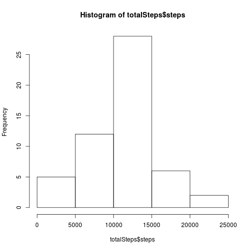
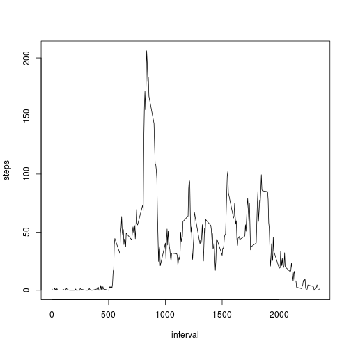
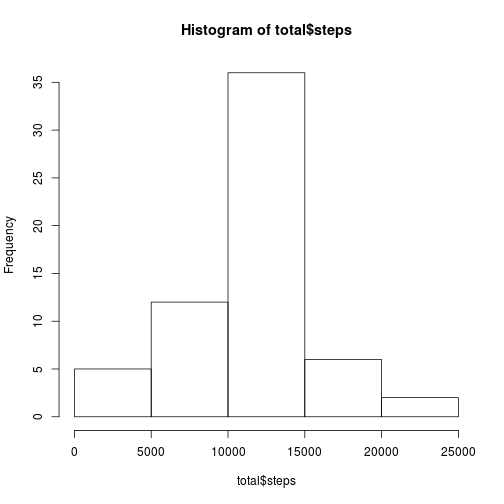
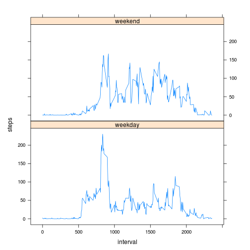

# Loading and preprocessing the data

## Load the data

```r
data <- read.csv(unzip("activity.zip"))
```

## Transform the data for analysis

```r
totalSteps <- aggregate(steps ~ date, data = data, sum, na.rm = TRUE)
```
# What is mean total number of steps taken per day?

## Create a histogram for the total number of steps each day

```r
hist(totalSteps$steps)
```

 
## Mean

```r
mean(totalSteps$steps)
```

```
## [1] 10766.19
```
## Median

```r
median(totalSteps$steps)
```

```
## [1] 10765
```
# What is the average daily activity pattern?

## Make a time series plot (i.e. type = "l") of the 5-minute interval (x-axis) and the average number of steps taken, averaged across all days (y-axis)

```r
stepsInt <- aggregate(steps ~ interval, data = data, mean, na.rm = TRUE)
plot(steps ~ interval, data = stepsInt, type = "l")
```

 
## Which 5-minute interval, on average across all the days in the dataset, contains the maximum number of steps?

```r
stepsInt[which.max(stepsInt$steps), ]$interval
```

```
## [1] 835
```
# Imputing missing values

## Calculate the total number of missing valeus

```r
sum(is.na(activity$steps))
```

```
## [1] 0
```
## Devise a strategy for filling in all of the missing values in the dataset
### Use the mean for 5-minute interval

```r
interval2steps <- function(interval) {
    stepsInt[stepsInt$interval == interval, ]$steps
}
```
## Fill in the missing data

```r
activity <- data
count = 0
for (i in 1:nrow(activity)) {
    if (is.na(activity[i, ]$steps)) {
        activity[i, ]$steps <- interval2steps(activity[i, ]$interval)
        count = count + 1
    }
}
cat("Total ", count, "NA values were filled.\n\r")
```

```
## Total  2304 NA values were filled.
## 
```
# Make a histogram of the total number of steps taken each day

```r
total <- aggregate(steps ~ date, data = activity, sum)
hist(total$steps)
```

 
## Calculate and report the mean and median total number of steps taken per day
### Mean

```r
mean(total$steps)
```

```
## [1] 10766.19
```
### Median

```r
median(total$steps)
```

```
## [1] 10766.19
```
## Do these values differ from the estimates from the first part of the assignment?
### The mean values do not differ, the median value has changed

## Are there differences in activity patterns between weekdays and weekends?

### Create a new factor variable in the dataset with two levels - “weekday” and “weekend” indicating whether a given date is a weekday or weekend day

```r
activity$day = ifelse(as.POSIXlt(as.Date(activity$date))$wday%%6 == 
    0, "weekend", "weekday")
```
#### For Sunday and Saturday : weekend, Other days : weekday
activity$day = factor(activity$day, levels = c("weekday", "weekend"))

### Make a panel plot containing a time series plot of the 5-minute interval and the average number of steps taken, averaged across all weekday days or weekend days

```r
stepsInt2 = aggregate(steps ~ interval + day, activity, mean)
library(lattice)
xyplot(steps ~ interval | factor(day), data = stepsInt2, aspect = 1/2, 
    type = "l")
```

 
